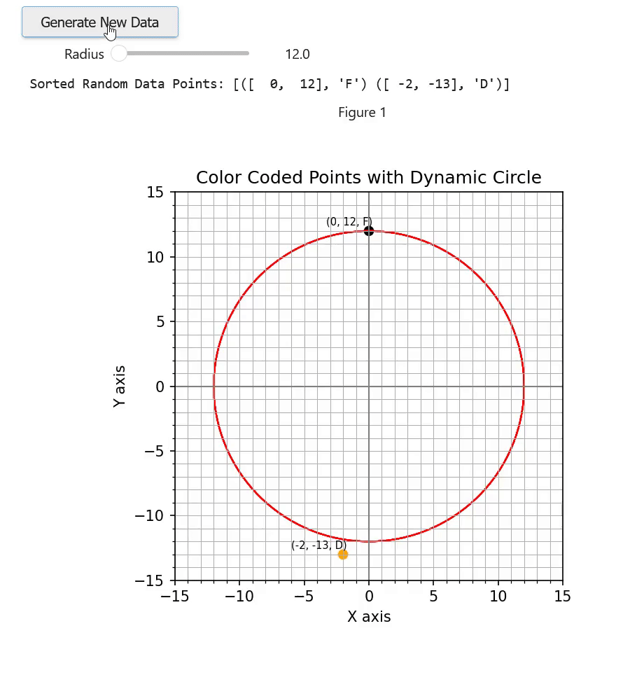
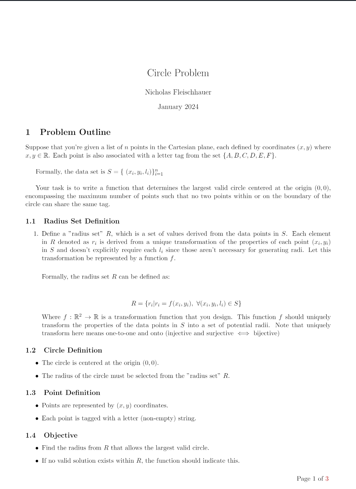

# Overview

This coding problem was one that took inspiration from the YouTuber [AiFlux](https://www.youtube.com/user/aiflux). I've refined upon the problem statement in a few ways briefly outlined in [What Changed, and Why?](#what-changed-and-why). It contains three files:

- [Circle_Problem.pdf](./docs/Circle_Problem.pdf) is the refined problem statement typed up in [Overleaf](https://www.overleaf.com/)
- [circle-problem-solution.pdf](./docs/circle-problem-solution.pdf) is the exported .pdf version of my [Jupyter Notebook](https://jupyter.org/) code
- [circle-problem-solution.ipynb](./src/circle-problem-solution.ipynb) the coded solution using Jupyter Notebook it also includes an [Interactive Tool](#interactive-tool) where you can drag a slider that snaps circles to the next radial point from the origin and a button that randomizes new sets of data.

This repo assumes you have sufficient knowledge on how to install all the needed packages like Numpy etc. If the coded solution can't run in Jupyter for you and you're unsure how to run the code, then just ask Chat GPT.

# What changed, and Why?

The original problem never stated the specifics of the problem space or defined it in a mathematically rigorous way. It was simply asked as a prompt to an LLM by the YouTuber [AiFlux](https://www.youtube.com/user/aiflux) as a means of evaluating it reasoning skills. He didn't spend much time going deeply into
how the model was attempting to solve it. At the time, I was preparing to interview candidates for positions on a project with NIST and decided that this would be a good question to ask them. Changes are listed below.

1. I restricted the space of potential circles since in theory, the circles could just get infinitesimally closer to the dots without actually touching or passing the threshold to enclose a duplicate point. At that point it would shift the focus of the problem away from what I believe was the original spirit of it and more towards one about floating point precision.

2. Points that lie on the radial shell/boundary of the circle will be considered members of that particular circle. This one may not be a change, since its possible that this part was already incorporated into his original problem statement. I've initially assumed that he didn't include this part.

# Interactive Tool

The interactive tool will generate a random set of data points for you based on some initial conditions you can play with such as `low`, `high`, and `label_space`. It includes a slider for expanding/contracting the circle, and a button to generate a new plot with a different set of data points.

# Problem Statement  Preview
note: (See more under ./docs/Circle_Problem_Prompt.pdf)

